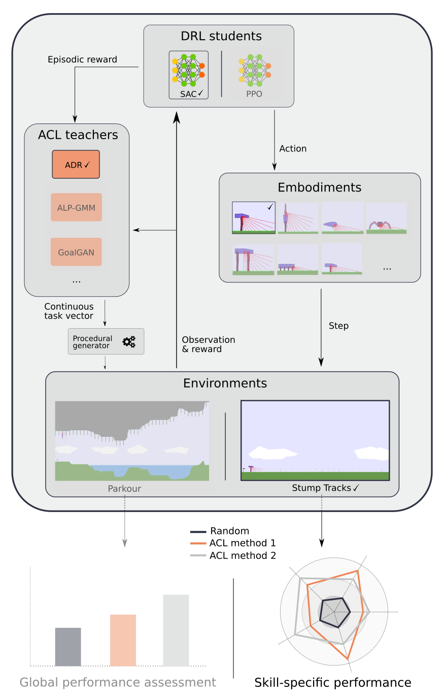

TeachMyAgent: a Benchmark for Automatic Curriculum Learning in Deep RL
==================================
`TeachMyAgent` is a testbed platform for **Automatic Curriculum Learning** methods. We leverage Box2D procedurally generated environments to assess the performance of teacher algorithms in continuous task spaces.
Our repository provides:
- **Two parametric Box2D environments**: Stumps Tracks and Parkour
- **Multiple embodiments** with different locomotion skills (e.g. bipedal walker, spider, climbing chimpanzee, fish)
- **Two DeepRL students**: SAC and PPO
- **Several ACL algorithms**: ADR, ALP-GMM, Covar-GMM, SPDL, GoalGAN, Setter-Solver, RIAC
- **Two benchmark experiments** using elements above: Skill-specific comparison and global performance assessment
- **A notebook for systematic analysis** of results using statistical tests along with visualisation tools (plots, videos...)
 
 
 
 Using this, we performed a benchmark of the previously mentioned ACL methods which can be seen in our [paper]. We also provide additional visualization on our [website].
 
 ## Table of Contents  
**[Installation](#installation)**<br>
**[Launching an experiment](#launching-an-experiment)**<br>
**[Launching a benchmark camaign](#launching-a-benchmark-campaign)**<br>
**[Visualizing results](#visualizing-results)**<br>
**[Code structure](#code-structure)**<br>

## Installation

1- Get the repository
```
git clone https://github.com/flowersteam/TeachMyAgent
cd TeachMyAgent/
```
2- Install it, using Conda for example (use Python >= 3.6)
```
conda create --name teachMyAgent python=3.6
conda activate teachMyAgent
pip install -e .
```

**Note: For Windows users, add `-f https://download.pytorch.org/whl/torch_stable.html` to the `pip install -e .` command.**

## Launching an experiment
You can launch an experiment using [`run.py`]:
```
python run.py --exp_name <name> --env <environment_name> <optional environment parameters> --student <student_name> <optional student parameters> --teacher <teacher_name> <optional teacher parameters>
```

Here is an example of a 10 millions steps training of PPO with the fish embodiment in Parkour using GoalGAN as teacher:

```
python run.py --exp_name TestExperiment --env parametric-continuous-parkour-v0 --embodiment fish --student ppo --nb_env_steps 10 --teacher GoalGAN --use_pretrained_samples
```

Possible arguments can be found in the [`run_utils`] subpackage (as mentioned in [Code structure](#code-structure)):
- [`environment_args_handler.py`]
- [`student_args_handler.py`]
- [`teacher_args_handler.py`]

## Launching a benchmark campaign
Performing a full benchmark campaign on an ACL method (as shown in our [paper]) can be done through multiple experiments.
We provide a away to generate a script containing all the experiments:
```
python TeachMyAgent/run_utils/generate_benchmark_script.py <campaign_name> --*teacher <teacher_name> <optional teacher parameters>
``` 

This will generate a script in [`benchmark_scripts/`] containing all the experiments to run. 
The script can then be used with our [`campaign_launcher.py`] (move your script to the root of the folder first):
```
python campaign_launcher.py <script_name>
```
Each experiment will be run with multiple seeds using slurm.

## Visualizing results
1- Launch a jupyter server:
```
jupyter notebook
```

2- Open our [`Results_Analysis.ipynb`] notebook

3- Import your data

4- Run plot definitions

5- Run plots with appropriate parameters

## Code structure
Our code is shared between 4 main folders in the [`TeachMyAgent`] package:
- [`environments`]: definition of our two procedurally generated environments along with embodiments
- [`students`]: SAC and PPO's implementations
- [`teachers`]: all the ACL algorithms
- [`run_utils`]: utils for running experiments and generating benchmark scripts

### Environments
All our environments respect the OpenAI Gym's interface. We use the environment's constructor to provide parameters such as embodiment.
Our environments must additionally provide a `set_environment()` method used by teachers to set tasks (warning: this method must be called before the `reset()` function).
Here is an example showing how to use the Parkour environment:
```python
import numpy as np
import time
import gym
import TeachMyAgent.environments

env = gym.make('parametric-continuous-parkour-v0', agent_body_type='fish', movable_creepers=True)
env.set_environment(input_vector=np.zeros(3), water_level = 0.1)
env.reset()

while True:
    _, _, d, _ = env.step(env.action_space.sample())
    env.render()
    time.sleep(0.1)
```
Hence, one can easily add a new environment in [`TeachMyAgent/environments/envs/`] as long as it implements the methods presented above. The new environment must then be added to the registration in [`TeachMyAgent/environments/__init__.py`].
Additionally, we introduced new physics (water and climbing) gathered in [`TeachMyAgent/environments/envs/Box2D_dynamics/`] which can be reused in your environment. See the `__init__()` and `step()` functions of the [`parametric_conitnuous_parkour.py`] for an example on how to use them. 
 
#### Embodiments
We put our embodiments in [`TeachMyAgent/environments/envs/bodies/`]. We classify them in three main categories (walkers, climbers, swimmers).
Each embodiment extends the [`AbstractBody.py`] class specifying basic methods such as sending actions to motors or creating the observation vector. Additionally, each embodiment extends an abstract class of its type (e.g. walker or swimmer) defining methods related to type-specific behaviour.
Finally, [`BodiesEnum.py`] is used to list all embodiments and provide access to their class using a string name. 

One must therefore add its new embodiment in the appropriate folder, extend and implement the methods of its parent abstract class and finally add its new class to the [`BodiesEnum.py`].
Note that if your embodiment has additional parameters, you should add them to the `get_body_wargs` method in [`environment_args_handler.py`].
  
### Students
We modified [SpinningUp's](https://github.com/openai/spinningup) implementation of SAC and [OpenAI Baselines'](https://github.com/openai/baselines) implementation of PPO in order to make them use a teacher algorithm. For a DeepRL student to be part of `TeachMyAgent`, it must take a teacher as parameter and call its `record_train_step` method at each step as well as its `record_train_episode` and `set_env_params` methods before every reset of the environment. Additionally, it must also take a test environment and use it to test its policy on it.
Here is an example of the way this must be implemented:
```python
# Train policy
o, r, d, ep_ret = env.reset(), 0, False, 0
Teacher.record_train_task_initial_state(o)
for t in range(total_steps):
    a = get_action(o)
    o2, r, d, infos = env.step(a)
    ep_ret += r
    Teacher.record_train_step(o, a, r, o2, d)
    o = o2

    if d:
        success = False if 'success' not in infos else infos["success"]
        Teacher.record_train_episode(ep_ret, ep_len, success)
        params = Teacher.set_env_params(env)
        o, r, d, ep_ret = env.reset(), 0, False, 0
        Teacher.record_train_task_initial_state(o)

# Test policy
for j in range(n):
    Teacher.set_test_env_params(test_env)
    o, r, d, ep_ret = test_env.reset(), 0, False, 0
    while not d:
        o, r, d, _ = test_env.step(get_action(o))
        ep_ret += r
    Teacher.record_test_episode(ep_ret, ep_len)
```

Your student must then be added to the [`students`] subpackage as well as in [`student_args_handler.py`].
Note that we provide a [`test_policy.py`] file which loads a task from a test set, loads a trained policy and use it in the task. This code currently only works for SpinningUp or Baselines models, so you should modify it if your student does not use any of these.

### Teachers
All our teachers extend the same [`AbstractTeacher`] class which defines their required methods:
- `record_initial_state(self, task, state)`: record initial state of the task.
- `episodic_update(self, task, reward, is_success)`: get episodic reward and binary success reward.
- `step_update(self, state, action, reward, next_state, done)`: get step related information.
- `sample_task(self)`: sample a task.
- (Optional) `non_exploratory_task_sampling(self)`: sample a task without exploration (used to visualize the curriculum as shown on our [website]).
- (Optional) `is_non_exploratory_task_sampling_available(self)`: whether the method above can be called.
- (Optional) `dump(self, dump_dict)`: save the teacher.

Teachers are then called through the [`TeacherController`] class, being the one passed to DeepRL students.
This class handles the storage of sampled tasks, possible reward interpretation as well as test tasks used when the `set_test_env_params` method is called.
In order to add a new teacher, one must extend the [`AbstractTeacher`] class and add its class among the possible ones in the following lines of the [`TeacherController`]:
```python
# setup tasks generator
if teacher == 'Random':
    self.task_generator = RandomTeacher(mins, maxs, seed=seed, **teacher_params)
elif teacher == 'RIAC':
    self.task_generator = RIAC(mins, maxs, seed=seed, **teacher_params)
elif teacher == 'ALP-GMM':
    self.task_generator = ALPGMM(mins, maxs, seed=seed, **teacher_params)
elif teacher == 'Covar-GMM':
    self.task_generator = CovarGMM(mins, maxs, seed=seed, **teacher_params)
elif teacher == 'ADR':
    self.task_generator = ADR(mins, maxs, seed=seed, scale_reward=scale_reward, **teacher_params)
elif teacher == 'Self-Paced':
    self.task_generator = SelfPacedTeacher(mins, maxs, seed=seed, **teacher_params)
elif teacher == 'GoalGAN':
    self.task_generator = GoalGAN(mins, maxs, seed=seed, **teacher_params)
elif teacher == 'Setter-Solver':
    self.task_generator = SetterSolver(mins, maxs, seed=seed, **teacher_params)
else:
    print('Unknown teacher')
    raise NotImplementedError
```

Finally, [`teacher_args_handler.py`] must be modified to add the teacher as well as its parameters.

## Citing

If you use `TeachMyAgent` in your work, please cite the accompanying [paper]:

```bibtex
@misc{romac2021teachmyagent,
      title={TeachMyAgent: a Benchmark for Automatic Curriculum Learning in Deep RL}, 
      author={Clément Romac and Rémy Portelas and Katja Hofmann and Pierre-Yves Oudeyer},
      year={2021},
      eprint={2103.09815},
      archivePrefix={arXiv},
      primaryClass={cs.LG}
}
```

[paper]: https://arxiv.org/abs/2103.09815
[website]: https://sites.google.com/view/teachmyagent/

[`run.py`]: run.py
[`benchmark_scripts/`]: benchmark_scripts/
[`campaign_launcher.py`]: campain_launcher.py
[`Results_Analysis.ipynb`]: Results_Analysis.ipynb

[`TeachMyAgent`]: TeachMyAgent
[`environments`]: TeachMyAgent/environments
[`students`]: TeachMyAgent/students
[`teachers`]: TeachMyAgent/teachers
[`run_utils`]: TeachMyAgent/run_utils

[`environment_args_handler.py`]: TeachMyAgent/run_utils/environment_args_handler.py
[`student_args_handler.py`]: TeachMyAgent/run_utils/student_args_handler.py
[`teacher_args_handler.py`]: TeachMyAgent/run_utils/teacher_args_handler.py

[`TeachMyAgent/environments/__init__.py`]: TeachMyAgent/environments/__init__.py
[`TeachMyAgent/environments/envs/`]: TeachMyAgent/environments/envs/
[`TeachMyAgent/environments/envs/Box2D_dynamics/`]: TeachMyAgent/environments/envs/Box2D_dynamics/
[`TeachMyAgent/environments/envs/PCGAgents/`]: TeachMyAgent/environments/envs/PCGAgents/
[`parametric_conitnuous_parkour.py`]: TeachMyAgent/environments/envs/parametric_continuous_parkour.py
[`TeachMyAgent/environments/envs/bodies/`]: TeachMyAgent/environments/envs/bodies/
[`AbstractBody.py`]: TeachMyAgent/environments/envs/bodies/AbstractBody.py
[`BodiesEnum.py`]: TeachMyAgent/environments/envs/bodies/BodiesEnum.py

[`test_policy.py`]: TeachMyAgent/students/test_policy.py

[`TeacherController`]: TeachMyAgent/teachers/teacher_controller.py
[`AbstractTeacher`]: TeachMyAgent/teachers/algos/AbstractTeacher.py